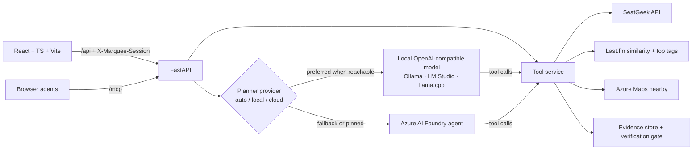

# Marquee

**A night-out planner that shows its work.**

Live demo: **https://marquee.icycoast-2869d7a0.eastus2.azurecontainerapps.io** — no login, no install.

Marquee finds concerts and events, plans a full evening around them (parking, dinner, show, bar), and — the part built for engineers to inspect — **verifies every factual claim it makes against retrieved source data before showing it to you**. Independent portfolio project; not affiliated with SeatGeek, Last.fm, or Microsoft.

## Why this exists

LLM products in ticketing fail in a specific way: they confidently invent prices, seat availability, artist genres, and "similar artists." Marquee is an argument that you can ship an AI planner that simply does not do that:

- **Every canonical event fact is machine-verified.** Data tools emit canonical statement lines (`[Event 18208670] Local date: 2026-10-24; local time: 20:00.`). A strict checker verifies the assistant's claims against session evidence with full-statement matching — free-form prose **fails closed**. No LLM grades its own homework.
- **Unknown stays unknown.** SeatGeek's public API supplies no price statistics for most events right now, so Marquee says "pricing not supplied" — it never estimates from vibes. Untagged performers are counted and reported as *unknown*, not guessed from the artist's name.
- **Every recommendation signal is attributed.** "Related discovery: Last.fm lists Tricky as similar to your favorite DJ Shadow (match 0.565)." When the Last.fm lookup fails, the UI says so instead of quietly substituting filler.
- **Provenance is layered by risk.** Actionable caveats ("Prices aren't available," "84 of 172 candidates had no genre tags") are always visible. The mechanics — candidate caps, ranking policy, tool calls, verification report — live under a collapsed "How this was found" disclosure with a `Facts verified N/N` badge. Failed verification is loud and inline.

## What it does

- **Natural-language planning chat** backed by an Azure AI Foundry agent (gpt-4.1-mini) with a bounded server-side tool loop — session-scoped, rate-capped, credentials never leave the server.
- **Switchable planner provider.** The same tool loop runs against a local OpenAI-compatible model (Ollama, LM Studio, llama.cpp) or the cloud agent. Pick `auto`, `local`, or `cloud` per conversation; `auto` prefers local and falls back to cloud **only on connectivity failure**, never to paper over a bad answer.
- **Genre discovery from source tags.** "Find me a punk show this weekend" filters on performer genre tags supplied by the live event data. Punk rock maps to Punk — never silently broadened to all of Rock.
- **Favorites + related-artist discovery.** Favorite artists get independent targeted retrieval (so a chronological cap can't hide an October show behind 300 September events) and rank first. With discovery enabled, Last.fm `artist.getSimilar` seeds attributed related picks, and alternatives are ordered by overlap with the favorites' Last.fm top-tag profile — a coarse tag like "Rock" breaks ties but never qualifies a pick on its own.
- **Disputable picks.** Tell the chat a suggestion misses the mark and it re-plans with that event excluded (`exclude_event_ids`) instead of just agreeing with you.
- **Park-once night plan.** Azure Maps supplies real restaurants, bars, and parking near the venue — straight-line distances and map links, with unconfirmed hours/rates/access explicitly labeled.
- **Agent-ready.** The same six tools the UI uses are exposed over an MCP endpoint (`/mcp`), and the frontend registers them with browser agents via WebMCP where supported.

## Architecture



- **Backend** ([server/](server/)): FastAPI; bounded/cached/retrying adapters per source; in-memory session evidence with expiry; strict canonical verification gate; chat loop with per-turn and hourly caps, swappable between a local OpenAI-compatible model and the cloud agent.
- **Frontend** ([web/](web/)): React + TypeScript + Vite. Search, shortlist personalization, comparison, evidence panel, editable night plan, chat.
- **Verification** happens server-side *before* tool output reaches the model: each event-producing tool call is auto-verified and the report ships with the reply.
- **Infra** ([infra/terraform/](infra/terraform/)): Azure Container Apps behind Terraform with remote Entra-authenticated state. The app runs with a **user-assigned managed identity** — AcrPull for image pulls and Azure AI User for the Foundry agent; zero registry passwords or Azure credentials in the container. Secrets (SeatGeek, Azure Maps, Last.fm) are Container Apps secrets fed from `TF_VAR_*` at deploy time.

## Honesty contract (what PASS does and doesn't mean)

`verify_plan` PASS means each canonical statement matches the session's retrieved snapshot — same event, same field, same value, evidence no older than ten minutes. It does **not** verify opinions, seat availability, upstream data accuracy, or AI commentary, and the UI labels commentary as unverified accordingly. Try it live: the evidence panel has buttons that inject a fake $48 price or a seat-availability claim so you can watch the checker fail them.

## Run it locally

Python 3.12+, Node 22+.

```powershell
python -m venv .venv
.\.venv\Scripts\python -m pip install -r requirements.txt
Copy-Item .env.example .env   # sample mode works with no keys at all
cd web; npm ci; npm run build; cd ..
.\.venv\Scripts\python -m uvicorn server.app:app --host 127.0.0.1 --port 8000 --no-proxy-headers
```

Open http://127.0.0.1:8000. Sample mode uses explicitly fictional events; live mode requires a SeatGeek client ID and never silently falls back to sample data on upstream failure.

### Run the planner on a local model (optional)

The chat loop speaks the OpenAI chat-completions API, so any local server that implements it works. The model must support tool calling — Marquee's whole point is that the model calls verified data tools rather than recalling facts.

```powershell
ollama serve
ollama pull qwen3:8b        # or any tool-calling model
```

Then in `.env`:

```ini
MARQUEE_AI_PROVIDER=local_first
LOCAL_LLM_BASE_URL=http://127.0.0.1:11434/v1   # LM Studio: http://127.0.0.1:1234/v1
LOCAL_LLM_MODEL=qwen3:8b
LOCAL_LLM_API_KEY=                             # only if your server requires one
```

Restart the server. The chat header shows the active provider (`Local · qwen3:8b`) and a live availability signal, and the provider selector lets you pin `local` or `cloud` for a conversation.

| Variable | Purpose |
|---|---|
| `MARQUEE_AI_PROVIDER=local_first` | Enables the local-first adapter with the configured Foundry/OpenAI model as backup |
| `LOCAL_LLM_BASE_URL` | OpenAI-compatible base URL, including `/v1` |
| `LOCAL_LLM_MODEL` | Model name as the local server reports it |
| `LOCAL_LLM_API_KEY` | Optional bearer token |
| `LOCAL_LLM_TOOL_OUTPUT_CHARS` | Per-tool-output truncation budget (default `6000`) so large event payloads fit a small context window |
| `LOCAL_LLM_PROXY` | Optional SOCKS proxy, scoped to local-model traffic only — used by the Tailscale sidecar so the deployed app can reach a private GPU box over the tailnet |

Behavior worth knowing:

- **Unreachable is a distinct state.** A connection failure fails over to cloud (or, with `local` pinned, says the model is unreachable). A reachable server that returns garbage raises an error instead — a quality problem is never masked by silent fallback.
- **Context overflow is the usual local failure.** Tool outputs are truncated to `LOCAL_LLM_TOOL_OUTPUT_CHARS` with an explicit marker; if the model still rejects the request, the reply says to start a new conversation or switch to cloud. Upstream error bodies stay in server logs.
- **Verification is unchanged.** The gate runs server-side on tool output regardless of which model produced the reply, so a small local model cannot lower the factual bar.

No local model configured? Leave `MARQUEE_AI_PROVIDER` on `azure_foundry` — nothing else changes.

### Tests

```powershell
.\.venv\Scripts\python -m pytest server/tests -q     # 72 tests
cd web; npm test; npm run build
```

Coverage includes planted false claims, event swaps, wrong amounts, session isolation, expired evidence, genre non-broadening, favorite retrieval beyond the candidate cap, related-artist attribution and failure states, tag-affinity ranking, dispute exclusion, forwarded-IP rate buckets, and API/MCP parity.

### Deploy

```powershell
scripts/deploy.ps1   # Terraform apply + az acr build + roll out a new image tag
```

Rerunning the script is the whole redeploy story: it stages a clean build context, builds in ACR, and applies the new tag.

## Data sources and limits

| Source | Used for | Not available / not claimed |
|---|---|---|
| SeatGeek public API | Events, venues, performers, genre tags | Prices, listings, seat inventory, seat imagery (fields are wired and null until authorized access exists) |
| Last.fm API | Similar artists, artist top tags — always attributed as recommendation signals | Treated as taste data, never as verified concert facts |
| Azure Maps | Nearby restaurants, bars, parking | Hours, rates, availability, walking routes, guaranteed access |

Retrieval is bounded (300 broad candidates plus targeted searches per favorite/related artist) and the UI reports coverage honestly rather than implying exhaustiveness. Bag policies are an unconfirmed official-source search link only.

## License

MIT — see [LICENSE](LICENSE).

